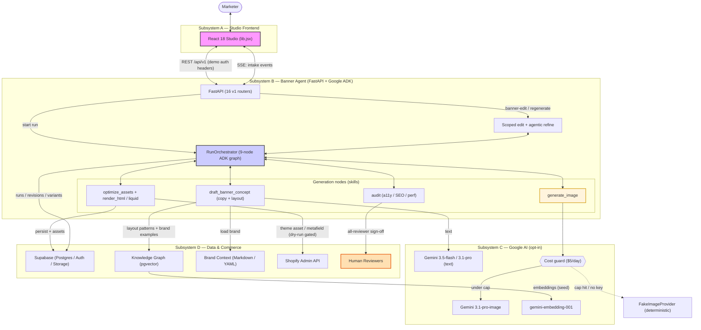
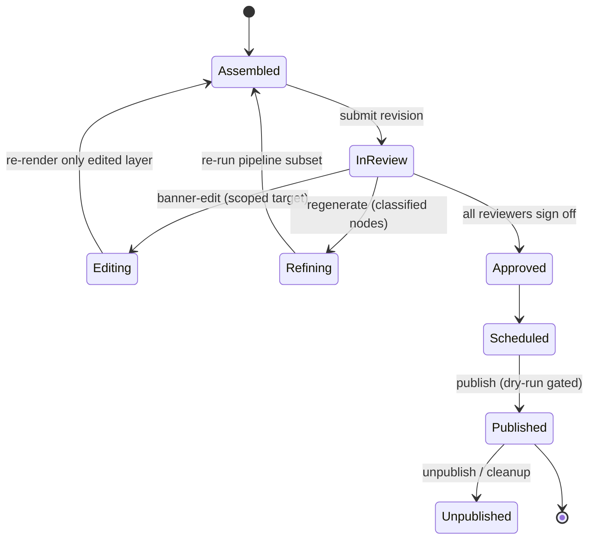
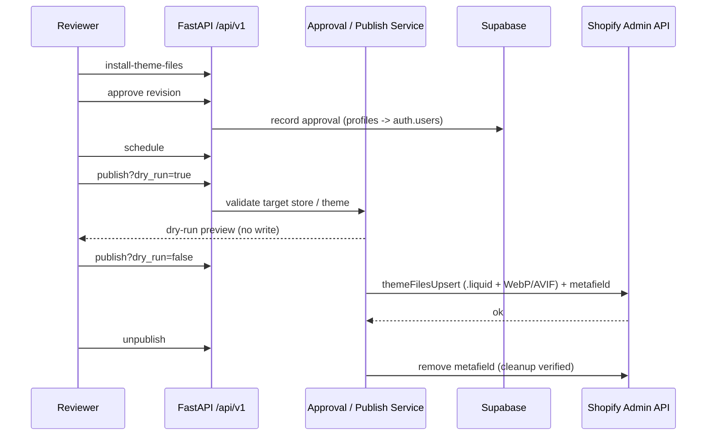

# Aijolot Banner Agent — Architecture

Agentic banner **creation → review → editing → scheduling → Shopify publishing**
workflow, built on **Google ADK + Gemini**, a **FastAPI** backend, **Supabase**
(Postgres / pgvector / Auth / Storage), and a **React 18** studio frontend that
drives the agentic pipeline through real, LLM-backed API calls.

> **Honest-MVP note.** Every AI node has a **deterministic fallback**, so the
> full pipeline (and the deterministic smoke path) runs with **no external network
> calls**. Real Gemini text/image, Supabase, Shopify publishing, and Lighthouse
> are **opt-in** via env flags and credentials. Performance/Lighthouse metrics are
> labeled mock/manual unless a live path is explicitly wired.

_Status: branch `feat/demo-functional-e2e`. Backend tests: **325 passed, 3 skipped** (clean env)._

---

## 1. Overview

| Subsystem | Responsibility | Core tech |
|-----------|----------------|-----------|
| **A — Studio frontend** | Placement → brief → art direction → generate → canvas → performance; triggers agentic actions | React 18 (static UMD/Babel prototype, `lib.jsx` API layer) |
| **B — Backend / Agent** | 16 `/api/v1` routers, ADK generation orchestrator, provider boundaries, persistence | FastAPI (Python 3.11), Google ADK |
| **C — AI providers** | Text, image, embeddings — opt-in with deterministic/cost-guarded fallbacks | Gemini (`3.1-pro`, `3.5-flash`, `3.1-pro-image`), `gemini-embedding-001` |
| **D — Data & commerce** | Brand context, knowledge graph, store publishing | Supabase (pgvector), Shopify Admin API |

The unit of work is a **9-node ADK generation graph** wrapped in a **12-stage
campaign lifecycle**: the orchestrator produces a fully assembled banner revision,
then a **human-in-the-loop (HITL) gate** (approval) precedes **schedule** and
**publish**. Designers can iterate with **agentic refine** (re-run classified
nodes) or **banner-edit** (scoped, non-destructive single-layer edit).

---

## 2. Operating modes

| Mode | When | Behavior |
|------|------|----------|
| **Deterministic / smoke** (default) | Demo, CI, offline | No Gemini/Shopify/Supabase/Lighthouse calls. Seeded fixtures, deterministic copy + `FakeImageProvider`. Repeatable. |
| **Live provider** (opt-in) | Env flags + credentials present | Real Gemini text/image, Supabase persistence, Shopify publish/unpublish, optional manual Lighthouse. |

Provider flags (each independently togglable; absence ⇒ deterministic):

| Flag | Controls | Live value |
|------|----------|------------|
| `AIJOLOT_INTAKE_PROVIDER` | Brief intake (text) | `gemini` |
| `AIJOLOT_CONCEPT_PROVIDER` | Concept + copy (text) | `gemini` |
| `AIJOLOT_REFINE_PROVIDER` | Refine / edit copy (text) | `gemini` |
| `IMAGE_GENERATION_PROVIDER` | Hero/product image | `gemini` |
| `GOOGLE_API_KEY` | Required for any real Gemini call | — |

Image generation is additionally guarded by a **cost guard**
(`backend/app/services/gemini/cost_guard.py`): a daily cap (`DAILY_COST_CAP_USD`,
default `5.0`) and per-image estimate (`~$0.04`). If the cap is hit or the key is
missing, it falls back to the free `FakeImageProvider` instead of failing.

---

## 3. Primary architecture diagram



**Reading the diagram**

- **Bidirectional arrows** = synchronous request/response (REST, SSE, orchestrator ↔ node).
- **Unidirectional arrows** = tool invocations / side effects (model calls, persistence, publish).
- **Dotted arrow** = cost-guard fallback to deterministic image provider.
- **Color:** magenta = user-facing, blue = orchestration, cream = media generation, orange = human gate.

---

## 4. Studio frontend → agentic actions

The frontend (`frontend/App.jsx` + `frontend/lib.jsx`) is a static React 18
prototype, but its API layer sends **demo auth headers** on every `/api/v1` call
and drives the real agentic backend. Stage flow:

| Stage | UI | Agentic backend action |
|-------|----|--------------------------|
| `placement` | Ubicación | `POST /placements/validate`, `POST /campaigns/{id}/placement` |
| `brief` | Brief comercial | `POST /campaigns/intake` (**SSE streaming**, Gemini-backed) → Campaign Brief v0.3.0 with personalization variants |
| `art` | Dirección de arte | `POST /campaigns/{id}/art-concepts` (per-variant), `art-prompts`, `model-prompts`, `background-options`, `generate-art` |
| `generate` | Generación | `POST /campaigns/{id}/generation-runs` → 9-node orchestrator; `GET …/events` for node-by-node progress |
| `canvas` | Lienzo colaborativo | Review revisions, select layout/variant, `banner-edit` (scoped), `regenerate` (agentic refine), approval threads, schedule, publish/unpublish |
| `performance` | Performance | `GET …/performance`, optimization proposals (non-live labeled) |

`lib.jsx` API clients: `CampaignApi`, `StoreApi`, `PlacementApi`, `CatalogApi`,
`ArtDirectionApi`, `ArtApi`, `BackgroundApi`, `GenerationApi`, `ReviewApi`,
`PerformanceApi`. Demo identity is baked in (`AIJOLOT_DEMO_AUTH_HEADERS`); base
URL is `window.AIJOLOT_API_BASE || "http://localhost:8000"`.

---

## 5. The generation pipeline (9 ADK nodes)

`RunOrchestrator` (`backend/app/services/banners/run_orchestrator.py`) executes
each node, emits per-node progress events, and persists `campaign_revision`,
`banner_variants`, `banner_layout_variants`, `audit_reports`, and the preview
into Supabase Storage.

```mermaid
graph LR
    N1["1. load_brand_context"] --> N2["2. intake_campaign_idea"]
    N2 --> N3["3. capture_user_personalization"]
    N3 --> N4["4. research_best_practices (KG)"]
    N4 --> N5["5. draft_banner_concept (copy + layout, per variant)"]
    N5 --> N6["6. generate_image (Gemini / fallback)"]
    N6 --> N7["7. optimize_assets (WebP/AVIF)"]
    N7 --> N8["8. render_html + liquid"]
    N8 --> N9["9. audit (a11y / SEO / perf)"]
    N9 --> GATE["HITL approval → schedule → publish"]

    style GATE fill:#FFE0B2,stroke:#E65100,stroke-width:2px
```



**Personalization & variant-aware generation.** The Campaign Brief carries
`personalization_variants` (e.g. `gender → {male, female}`). The orchestrator
generates **one `banner_variant` per personalization variant** with
variant-specific copy (eyebrow/headline/subheadline/CTA) and shared palette; an
empty list collapses to a single default audience.

---

## 6. Editing & refinement (HITL)

Two distinct iteration paths sit between generation and publish:

- **Agentic refine** (`POST /campaigns/{id}/regenerate`) — re-runs the pipeline
  for classified `target_nodes`, producing a new revision.
- **Banner-edit** (`POST /campaigns/{id}/banner-edit`) — a **scoped,
  non-destructive** edit: changes only the targeted layer (copy / background /
  image / layout), carries the rest forward from the source revision, re-renders
  + re-audits, and persists a superseding revision.



---

## 7. Publish data flow (live-provider mode)



> Verified end-to-end against a real Shopify dev store
> (`install → approve → schedule → dry-run → publish → unpublish`).
> Publishing is **fail-closed** without real credentials and a safe target store/theme.

---

## 8. Skill contracts

Skills live under `backend/app/agents/skills/<name>/SKILL.md` (+ `impl.py`).
Contracted skills:

| Skill | Version | Role | Type |
|-------|---------|------|------|
| `campaign-intake` | 0.3.0 | Conversational brief → **Campaign Brief v0.3.0** (goal/audience/CTA/tone/urgency + personalization variants + promo) | LLM (Gemini flash) + deterministic |
| `art-direction` | 0.1.0 | Orchestrates nodes 4–7 per variant: layout retrieval → copy → background → product/model | Orchestration (LLM + KG) |
| `banner-edit` | 0.1.0 | Classify feedback → edit only target layer → re-render + re-audit → superseding revision | Orchestration (classifier + edit) |
| `shopify-theme-publish` | 0.3.0 | Node 12 write action: `themeFilesUpsert` + metafield, dry-run default, install/unpublish | Deterministic (no LLM) |

Other implemented skills: `brand-context-load`, `user-personalization`,
`best-practices-retrieve`, `banner-concept-draft`, `image-prompt-refine`,
`nano-banana-image-generate`, `image-asset-optimize`, `banner-html-seo-render`,
`liquid-section-build`, `performance-audit`, `refinement-route`,
`schedule-or-publish-route`.

---

## 9. `/api/v1` routers

`backend/app/api/v1/router.py` mounts 16 routers:

`brands · intake · campaigns · stores · placements · catalog · art_direction ·
backgrounds · art · generation · previews · approvals · schedules · publishing ·
performance · scheduler`

Canonical routes require demo auth context (`X-Aijolot-User-Id` / `-Team-Id` /
`-Store-Id`, or `Bearer demo:<user>:<team>[:<store>]`). Root compatibility routes
(`/brands`, `/campaigns/intake`, `/campaigns/{id}`) remain unauthenticated for
prototype compatibility.

---

## 10. Repository layout

```text
backend/      FastAPI backend, ADK skills, Gemini provider boundaries, Supabase/Shopify services, tests
frontend/     Static React 18 prototype (App.jsx) + API layer (lib.jsx)
brands/       Versioned brand context Markdown/YAML (import / fallback)
supabase/     Local Supabase config, migrations, seed data, storage buckets
docs/         Architecture docs, API/frontend contracts, demo docs, plans
demo/         Demo scenarios and presentation support
scripts/      Reset / smoke / developer automation
obsidian/     Git-synced project notes and DB design
```

---

## 11. Service topology

| Service | Local URL | Notes |
|---------|-----------|-------|
| Backend API | `http://localhost:8000` (`/docs`, `/health`) | `/api/v1` requires demo auth context |
| Frontend | `http://localhost:5500` | Static server; `window.AIJOLOT_API_BASE \|\| http://localhost:8000` |
| Supabase API | `http://127.0.0.1:55321` | Local stack via `supabase start` |
| Supabase Studio | `http://127.0.0.1:55323` | |
| Supabase DB | `127.0.0.1:55322` | Postgres + pgvector |

---

## 12. Key design decisions

1. **Deterministic fallback per node** — the whole pipeline runs offline; the
   demo is repeatable and CI-safe.
2. **Cost-guarded real LLM** — image generation reserves against a daily USD cap
   and degrades to a free deterministic provider instead of failing.
3. **Grounding over free-form** — concepts are anchored in retrieved KG layout
   patterns with stored provenance (`Concept.source_refs`).
4. **Sanitize AI-generated CSS/HTML** — generated backgrounds strip `@import`,
   remote `url()`, `expression()`, `<script>`/`<iframe>`, inline `on*=` handlers.
5. **Two iteration modes** — agentic refine (re-run nodes) vs. banner-edit
   (scoped, non-destructive single-layer edit), both producing superseding revisions.
6. **HITL is a first-class gate** — all-reviewer approval before schedule/publish.
7. **Fail-closed commerce** — Shopify publish needs real credentials + a safe
   target; `?dry_run=` previews without writing.

---

## 13. Tech stack summary

| Layer | Primary tech | Secondary |
|-------|--------------|-----------|
| **Reasoning / text** | Gemini `3.5-flash` (intake/copy/refine), `3.1-pro` (heavy concept) | Deterministic fallback |
| **Media generation** | Gemini `3.1-pro-image` | Cost guard → `FakeImageProvider`; WebP/JPG, optional AVIF |
| **Retrieval** | Supabase pgvector + `gemini-embedding-001` | Static KG floor |
| **Orchestration** | Google ADK — 9-node generation graph | Per-node event streaming, agentic refine + banner-edit |
| **Backend** | FastAPI (Python 3.11) | Pytest (325 passed / 3 skipped) |
| **Data / Auth / Storage** | Supabase (Postgres) | Markdown/YAML brand fallback |
| **Commerce** | Shopify Admin API (`themeFilesUpsert` + metafield) | Dry-run gated publish/unpublish |
| **Frontend** | React 18 studio (static prototype) | SSE intake, `lib.jsx` API layer |

---

_License: MIT._
