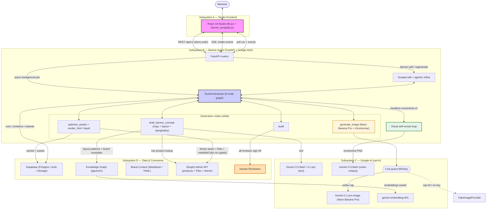
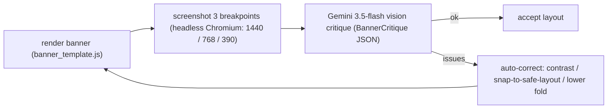
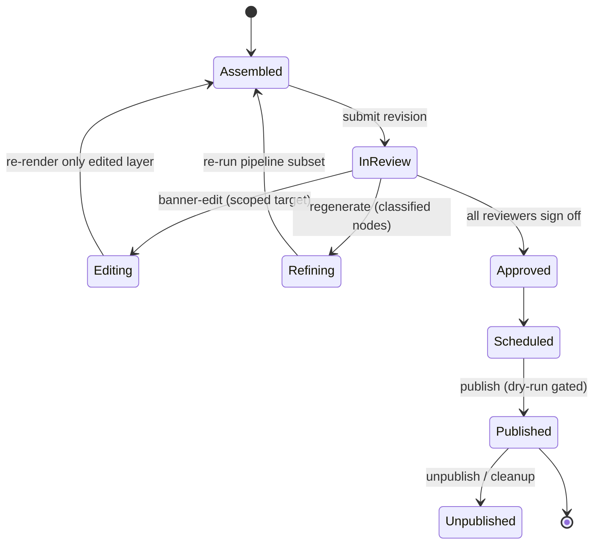
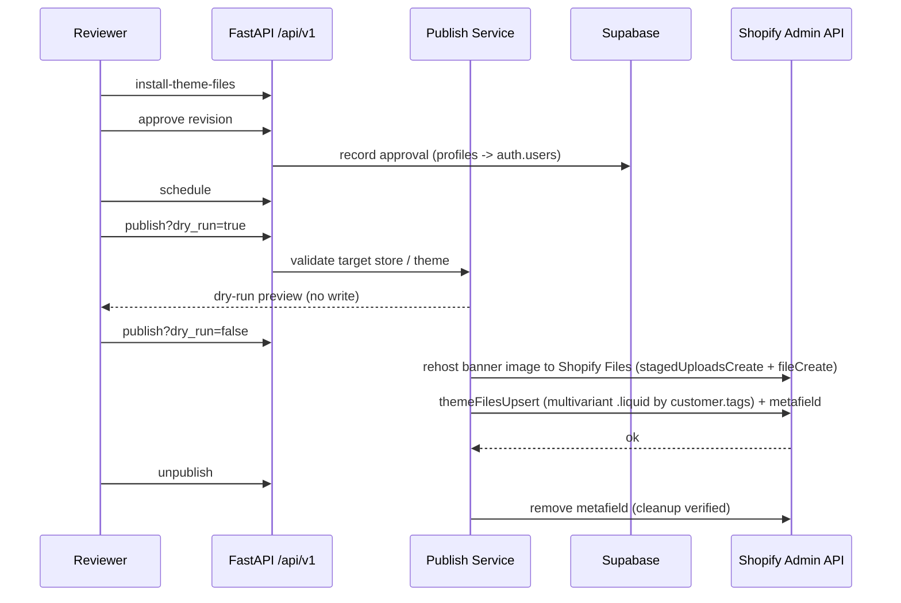
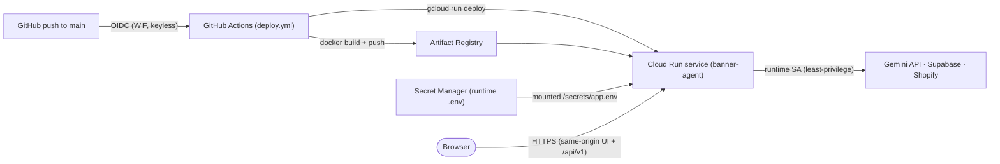

# Aijolot Banner Agent — Architecture

Agentic banner **creation → visual self-review → editing → scheduling → Shopify
publishing** workflow, built on **Google ADK + Gemini**, a **FastAPI** backend,
**Supabase** (Postgres / pgvector / Auth / Storage), and a **React 18** studio
frontend that drives the agentic pipeline through real, LLM-backed API calls.

> **Honest-MVP note.** Every AI node has a **deterministic fallback**, so the full
> pipeline (and the deterministic smoke path) runs with **no external network
> calls**. Real Gemini text/image/video, live Shopify product resolution + publishing,
> Supabase, and Lighthouse are **opt-in** via env flags and credentials.
> Performance/Lighthouse metrics are labeled mock/manual unless a live path is wired.

_Status: merged to `main` (PRs #21 grounded iterate/canvas, #22 brand discovery + font system, #23 Shopify connection). Backend tests: **750 passed, 13 skipped** (clean env)._

> Companion docs: brand discovery + approved-font typography is specified in
> [`docs/architecture/brand-discovery-and-font-system.md`](docs/architecture/brand-discovery-and-font-system.md);
> the full HTTP surface in [`docs/architecture/api-contract.md`](docs/architecture/api-contract.md).

---

## 1. Overview

| Subsystem | Responsibility | Core tech |
|-----------|----------------|-----------|
| **A — Studio frontend** | Placement → brief → plan → generate → canvas → performance; commercial-calendar + suggestions panels; brand-discovery/typography view; ES/EN switcher; triggers agentic actions, polls async runs, renders live banner | React 18 (static prototype) + shared `banner_template.js` |
| **B — Backend / Agent** | `/api/v1` routers, ADK generation orchestrator (two-phase plan→build), async jobs, visual self-review, provider boundaries, persistence | FastAPI (Python 3.11), Google ADK |
| **C — AI providers** | Text, image (Nano Banana Pro), video (Veo 3.1), vision critique, embeddings — opt-in with deterministic/cost-guarded fallbacks | Gemini (`3.1-pro`, `3.5-flash`, `3.1-pro-image`), `veo-3.1-generate-preview`, `gemini-embedding-001` |
| **D — Data & commerce** | Brand context + Shopify brand discovery, knowledge graph, store connection, live Shopify products + publishing | Supabase (pgvector), Shopify Admin API |

The unit of work is a **9-node ADK generation graph** split into a **two-phase
plan→build** flow and wrapped in a **calendar → suggestion → brief → plan →
generate → review → publish lifecycle**. Upstream, a **commercial calendar**
emits **proactive suggestions** that prefill a brief; from the brief the agent
proposes a **placement plan** (the set of pieces to design) and a **creative mode**
per piece. Generation runs as a cheap, iterable **PLAN phase** (nodes 1–5:
concept + placement plan + creative mode + image prompt) and, on approval, a costly
**BUILD phase** (nodes 6–9: image/video → optimize → render → audit). The
orchestrator assembles a banner revision (per audience variant), runs an
**autonomous visual self-review loop**, then a **human-in-the-loop (HITL) gate**
(approval) precedes **schedule** and **publish**. Generation and editing run as
**async background jobs** the frontend polls. Designers iterate via **plan/iterate**
(retune before build), **agentic refine** (re-run classified nodes), or
**banner-edit** (scoped, non-destructive single-layer edit).

---

## 2. Operating modes

| Mode | When | Behavior |
|------|------|----------|
| **Deterministic / smoke** (default) | Demo, CI, offline | No Gemini/Shopify/Supabase/Lighthouse calls. Seeded fixtures, deterministic copy + `FakeImageProvider`. Repeatable. |
| **Live provider** (opt-in) | Env flags + credentials present | Real Gemini text/image/vision, live Shopify product resolution + publish/unpublish, Supabase persistence, optional manual Lighthouse. |

Provider flags (each independently togglable; absence ⇒ deterministic):

| Flag | Controls | Live value |
|------|----------|------------|
| `AIJOLOT_INTAKE_PROVIDER` | Brief intake (text) | `gemini` |
| `AIJOLOT_CONCEPT_PROVIDER` | Concept, copy, typography, headline styling, visual critique | `gemini` |
| `AIJOLOT_REFINE_PROVIDER` | Refine / edit copy | `gemini` |
| `IMAGE_GENERATION_PROVIDER` | Hero/product image (Nano Banana Pro) | `gemini` |
| `VIDEO_GENERATION_ENABLED` | Gates the `video` creative mode (Veo 3.1); absent ⇒ video never recommended/run | `true` |
| `GOOGLE_API_KEY` | Required for any real Gemini/Veo call | — |

Image generation is guarded by a **cost guard**
(`backend/app/services/gemini/cost_guard.py`): a daily cap (`DAILY_COST_CAP_USD`,
default `5.0`) and per-image estimate (`~$0.04`). If the cap is hit or the key is
missing, it falls back to the free `FakeImageProvider` instead of failing.

---

## 3. Primary architecture diagram



**Reading the diagram** — bidirectional arrows = synchronous request/response
(REST, SSE, poll, orchestrator ↔ node); unidirectional = tool calls / side
effects; dotted = cost-guard fallback. Color: magenta = user-facing, blue =
orchestration, cream = media gen, green = visual self-review, orange = human gate.

---

## 4. Async execution model

Generation and editing are **non-blocking background jobs**
(`GenerationRunService`, `backend/app/services/banners/generation_run_service.py`):

- `POST /campaigns/{id}/generation-runs` (and `/banner-edit`, `/regenerate`)
  launch a daemon thread and return immediately with status `running`.
- The frontend polls `GET /generation-runs/{run_id}` (status + `finished_at`) and
  `GET /generation-runs/{run_id}/events` (per-node started/succeeded events with
  durations + cost), then fetches the latest revision when the run finishes.

This keeps the UI responsive during real (slow) Gemini image generation and the
headless screenshot review.

---

## 5. The generation pipeline (upstream signals + 9 ADK nodes)

### 5.0 Upstream: commercial calendar → suggestions → placement plan

Before any generation, two upstream layers decide *what to make*:

- **Commercial calendar** (`/api/v1/calendar/*`, `CalendarService`): a global seed
  of niche commercial dates plus per-team events, with lead-time / auto-concept /
  enabled settings and optional LLM niche-date inference. An **agent-jobs poller**
  (`/api/v1/agent-jobs/process`, the backend side of a `pg_cron` scan queue) turns
  calendar, catalog, and performance signals into **proactive suggestions**.
- **Suggestions** (`/api/v1/suggestions`): pending suggestions the user can
  `accept` (calendar/catalog → create a campaign with a prefilled brief;
  performance → a refinement run) or `dismiss`.
- **Placement plan** (`placement-plan-recommend`, run inside the PLAN phase): from
  the brief the agent proposes the **set of pieces** to design (hero, collection
  header, announcement bar, PDP cross-sell…), each with real catalog dimensions and
  a creative mode. Piece 1 (`hero_main`) is built on approve; the rest are the
  campaign roadmap. **Placement is a consequence of the brief**, not a manual
  pre-step (deterministic brief-driven floor, Gemini-refined).

### 5.1 The 9-node graph

`RunOrchestrator` (`backend/app/services/banners/run_orchestrator.py`) executes
each node, emits per-node progress events, and persists `campaign_revision`,
`banner_variants`, `banner_layout_variants`, `audit_reports`, and the preview into
Supabase Storage.

```mermaid
graph LR
    subgraph PLAN["PLAN phase (cheap, iterable — plan-runs / plan/iterate)"]
        N1["1. load_brand_context"] --> N2["2. intake_campaign_idea"]
        N2 --> N3["3. capture_user_personalization"]
        N3 --> N4["4. research_best_practices (KG)"]
        N4 --> N5["5. draft_banner_concept + placement plan + creative mode + image prompt"]
    end
    N5 --> APPROVE{{"plan/approve"}}
    subgraph BUILD["BUILD phase (costly — runs on approve)"]
        APPROVE --> N6["6. generate_image (Nano Banana Pro + chroma-key) / generate_video (Veo 3.1)"]
        N6 --> N7["7. optimize_assets (WebP/AVIF)"]
        N7 --> N8["8. render_html + liquid (+ visual self-review)"]
        N8 --> N9["9. audit (a11y / SEO / perf)"]
    end
    N9 --> GATE["HITL approval → schedule → publish"]

    style APPROVE fill:#ccf,stroke:#333,stroke-width:2px
    style GATE fill:#FFE0B2,stroke:#E65100,stroke-width:2px
```



**Two-phase plan→build.** `POST /campaigns/{id}/plan-runs` runs only nodes 1–5
(brand → intake → personalization → KG → concept) plus the placement plan and
creative-mode decision — no image/video spend. The user inspects and retunes via
`POST /campaigns/{id}/plan/iterate` (the visible image prompt is editable), then
`POST /campaigns/{id}/plan/approve` runs the costly nodes 6–9. `GET
/campaigns/{id}/plan` returns the current plan. This keeps exploration free and
spends real model budget only on an approved direction.

**Creative modes** (`creative-mode-recommend`, advisory; a user override
`mode_source='user'` always wins): `composite` (product cut-out over an AI
background — today's default), `full_picture` (Nano Banana generates the full
scene, full-bleed; only text + CTA are HTML), and `video` (a short Veo 3.1 loop as
the hero, gated on `VIDEO_GENERATION_ENABLED` and main-hero placement). In `video`
mode node 6 becomes `generate_video` (`backend/app/services/banners/video_gen.py`,
Veo 3.1 with a deterministic `FakeVideoProvider` fallback) and still produces a
poster image.

**Variant-aware, product-grounded generation.** The Campaign Brief carries
`personalization_variants` (e.g. `gender → {male, female}`), each able to reference
its **own featured product** (`product_gid` / `product_title` / `product_image_url`).
The orchestrator generates **one `banner_variant` per variant**, grounding that
variant's copy and hero image on its product (e.g. male → "Mandarin Sky",
female → "My Way Intense"), with a shared palette.

**Percentage-first composition + agent-chosen typography.** Layout is expressed as
0–100% coordinates (`ArtDirection` in `backend/app/schemas/typography.py`:
`text_x/y/w`, `hero_x/y/w/h`, `text_align`, `hero_behind`), never fixed pixels.
The agent proposes display/body fonts from an allow-list (`DISPLAY_FONTS`,
`BODY_FONTS`) and optional per-word headline runs (bold/italic/color/size), gated
on background contrast. `banner_template.js` is shared between the in-browser
Canvas and the backend headless renderer for render parity.

**Image hero (Nano Banana Pro + chroma-key).** Product heroes are generated on a
pure green field, then `image_compose.chroma_key_to_png()`
(`backend/app/services/gemini/image_compose.py`) keys out the background into a
transparent RGBA PNG with feathered alpha, composited per variant.

---

## 6. Autonomous visual self-review loop

After render, `banner_review.review_and_correct()`
(`backend/app/services/banners/banner_review.py`) runs a closed agentic QA loop
(`max_iters=2`):



The vision model returns structured verdicts (`legible`, `text_clipped`,
`hero_collision`, suggested `text/hero` %). Corrections are deterministic and
conservative: strip low-contrast headline tints; snap a failed desktop composition
to a canonical safe layout (copy left, hero right, vertically centered); widen the
mobile/tablet fold up to ~18% on overflow. The loop is best-effort — it degrades
gracefully if Chromium or the vision model is unavailable.

---

## 7. Editing & refinement (HITL)

- **Agentic refine** (`POST /campaigns/{id}/regenerate`) — re-runs the pipeline for
  classified `target_nodes`, producing a new revision.
- **Banner-edit** (`POST /campaigns/{id}/banner-edit`) — a **scoped,
  non-destructive** edit: changes only the targeted layer (copy / background /
  image / layout), carries the rest forward, re-renders + re-audits, and persists a
  superseding revision.



---

## 8. Publish data flow (live-provider mode)



**Multivariant publish.** `liquid_payload_builder.build_liquid_payload()` emits an
OS 2.0 section + snippet whose Liquid loops over `customer.tags` and serves the
matching variant's copy (``), defaulting to the first variant.
**Asset rehosting.** `shopify_files.rehost_config_assets()` detects locally-hosted
image URLs and uploads them to Shopify Files (staged upload → `fileCreate` → CDN
URL) before a real publish; failures keep the original URL and still render.

> Verified end-to-end against a real Shopify dev store
> (`install → approve → schedule → dry-run → publish → unpublish`).
> Publishing is **fail-closed** without real credentials and a safe target store/theme.

---

## 9. Skill contracts

Skills live under `backend/app/agents/skills/<name>/SKILL.md` (+ `impl.py`).

| Skill | Version | Role | Type |
|-------|---------|------|------|
| `campaign-intake` | 0.3.0 | Conversational brief → **Campaign Brief v0.3.0** (goal/audience/CTA/tone + personalization variants + promo) | LLM (Gemini flash) + deterministic |
| `placement-plan-recommend` | 0.1.0 | Brief → the **set of pieces** to design (placement + format + creative mode + rationale), capped at 4; placement is a consequence of the brief | LLM (Gemini flash) + deterministic floor |
| `creative-mode-recommend` | 0.1.0 | Brief + brand + placement → `composite` / `full_picture` / `video` + `include_humans`; advisory, user override wins; video env-gated | LLM (Gemini flash) + keyword fallback |
| `art-direction` | 0.1.0 | Orchestrates nodes 4–7 per variant: layout → copy → background → product/model | Orchestration (LLM + KG) |
| `banner-edit` | 0.1.0 | Classify feedback → edit only target layer → re-render + re-audit → superseding revision | Orchestration (classifier + edit) |
| `shopify-theme-publish` | 0.3.0 | Node 12 write action: rehost to Files + `themeFilesUpsert` + metafield, dry-run default | Deterministic (no LLM) |

Other implemented skills: `brand-context-load`, `user-personalization`,
`best-practices-retrieve`, `layout-retrieve`, `banner-concept-draft`,
`art-prompt-propose`, `background-options-generate`, `image-prompt-refine`,
`nano-banana-image-generate`, `image-asset-optimize`, `banner-html-seo-render`,
`liquid-section-build`, `performance-audit`, `refinement-interpret`,
`refinement-route`, `hitl-review-handoff`, `schedule-or-publish-route`.

Brand discovery + the approved-font typography system (Shopify-evidence discovery
runs, Gemini color-role drafts, font candidates, explicit user-accept gate) are
specified in their own contract:
[`docs/architecture/brand-discovery-and-font-system.md`](docs/architecture/brand-discovery-and-font-system.md).

---

## 10. Repository layout

```text
backend/      FastAPI backend, ADK skills, Gemini provider boundaries, Supabase/Shopify services, tests
frontend/     Static React 18 prototype (App.jsx), API layer (lib.jsx), shared banner renderer (banner_template.js)
brands/       Versioned brand context Markdown/YAML (import / fallback)
supabase/     Local Supabase config, migrations, seed data, storage buckets
docs/         Architecture docs, API/frontend contracts, demo docs, plans
demo/         Demo scenarios and presentation support
scripts/      Reset / smoke / developer automation
obsidian/     Git-synced project notes and DB design
```

---

## 11. Service topology

| Service | Local URL | Notes |
|---------|-----------|-------|
| Backend API | `http://localhost:8000` (`/docs`, `/health`) | `/api/v1` requires demo auth context |
| Frontend | `http://localhost:5500` | Static server; `window.AIJOLOT_API_BASE \|\| http://localhost:8000` |
| Supabase API | `http://127.0.0.1:55321` | Local stack via `supabase start` |
| Supabase Studio | `http://127.0.0.1:55323` | |
| Supabase DB | `127.0.0.1:55322` | Postgres + pgvector |

---

## 12. Deployment (Google Cloud Run)

The app ships as a **single container** (FastAPI backend + static React frontend +
Playwright/Chromium) deployed to **Cloud Run**, with keyless CI via **Workload
Identity Federation** and runtime config in **Secret Manager**.



**Container** (`Dockerfile`): `python:3.11-slim`, installs the backend package
(deps from `backend/pyproject.toml`, incl. `playwright`), runs
`playwright install --with-deps chromium` for the screenshot self-review, copies
the static `frontend/`, and starts via `backend/docker-entrypoint.sh`. The
entrypoint sources a dotenv file mounted from Secret Manager
(`/secrets/app.env`), then runs `uvicorn app.main:app --host 0.0.0.0 --port $PORT`
(Cloud Run injects `$PORT=8080`). The frontend is served **same-origin** through
`StaticFiles`, and `window.AIJOLOT_API_BASE` defaults to `window.location.origin`
— so no separate frontend host or CORS wiring is needed in prod.

**Cloud Run config** (`.github/workflows/deploy.yml`): `--cpu=2 --memory=2Gi
--timeout=600 --concurrency=20 --min-instances=0 --max-instances=4
--allow-unauthenticated`, deployed under a least-privilege runtime SA with the
runtime secret mounted at `/secrets/app.env`. (Auth is open because demo identity
is header-based; tighten with IAM/IAP for non-demo use.)

**One-time setup** (`scripts/gcp-bootstrap.sh`, idempotent): creates the project,
enables APIs (`run`, `artifactregistry`, `secretmanager`, `iamcredentials`, `sts`,
`cloudbuild`), an Artifact Registry repo, a `github-deployer` SA + a
`banner-agent-runtime` SA, the WIF pool/provider scoped to the repo, and the
runtime secret — then prints the GitHub repo variables to set.

**Runtime env (Secret Manager `app.env`).** Live providers are opt-in; absence
keeps each node deterministic. Key vars: `GOOGLE_API_KEY` (+ `GOOGLE_CLOUD_PROJECT`
/ `GOOGLE_CLOUD_LOCATION`), `AIJOLOT_*_PROVIDER=gemini`, `IMAGE_GENERATION_PROVIDER`,
`DAILY_COST_CAP_USD`; `SUPABASE_URL` / `SUPABASE_ANON_KEY` /
`SUPABASE_SERVICE_ROLE_KEY` / `SUPABASE_STORAGE_BUCKET`; `SHOPIFY_SHOP_DOMAIN` /
`SHOPIFY_ADMIN_ACCESS_TOKEN` / `SHOPIFY_API_VERSION` / `SHOPIFY_THEME_ID` /
`SHOPIFY_PUBLISH_DRY_RUN`; optional `CORS_ALLOW_ORIGINS`.

**Deploy flow:** run `gcp-bootstrap.sh` once → set the printed repo variables →
push to `main` (or run the workflow manually). The job builds, pushes, deploys,
and prints the service URL.

**Tuning notes.** The image bundles Chromium, so cold starts are heavier — consider
`--min-instances=1` for demos. Each screenshot review spawns a headless browser;
at `--concurrency=20` on `2Gi`, concurrent reviews can pressure memory — raise
memory or lower concurrency if OOMs appear.

---

## 13. Key design decisions

1. **Async by default** — generation/edit run as background jobs the UI polls, so
   real (slow) image gen + screenshot review never block the request.
2. **Close the loop with vision** — the banner reviews *itself* via headless
   screenshots + a vision LLM, then deterministically corrects contrast/layout/overflow.
3. **Deterministic fallback per node** — the whole pipeline runs offline; the demo
   is repeatable and CI-safe.
4. **Cost-guarded real LLM** — image generation reserves against a daily USD cap and
   degrades to a free deterministic provider instead of failing.
5. **Percentage-first, parity render** — one `banner_template.js` renders in the
   browser and in backend Node, so what reviewers see matches what was reviewed.
6. **Grounding over free-form** — concepts anchored in KG layout patterns + each
   variant grounded on its own live Shopify product; generated CSS/SVG/HTML sanitized.
7. **HITL is a first-class gate** — all-reviewer approval before schedule/publish.
8. **Fail-closed commerce** — Shopify publish needs real credentials + a safe target;
   `?dry_run=` previews without writing; asset rehosting failures degrade gracefully.

---

## 14. Tech stack summary

| Layer | Primary tech | Secondary |
|-------|--------------|-----------|
| **Reasoning / text** | Gemini `3.5-flash` (intake/copy/typography/refine), `3.1-pro` (heavy concept) | Deterministic fallback |
| **Vision QA** | Gemini `3.5-flash` (screenshot critique) | Headless Chromium, 3 breakpoints |
| **Media generation** | Gemini `3.1-pro-image` (Nano Banana Pro) + chroma-key compositing; Veo `3.1` video heroes | Cost guard → `FakeImageProvider` / `FakeVideoProvider`; WebP/JPG, optional AVIF |
| **Retrieval** | Supabase pgvector + `gemini-embedding-001` | Static KG floor |
| **Orchestration** | Google ADK — 9-node graph, two-phase plan→build, async jobs | Per-node events, plan/iterate, agentic refine + banner-edit |
| **Backend** | FastAPI (Python 3.11) | Pytest (750 passed / 13 skipped) |
| **Data / Auth / Storage** | Supabase (Postgres) | Markdown/YAML brand fallback; Shopify brand discovery |
| **Commerce** | Shopify Admin API — live products, Files rehost, multivariant `themeFilesUpsert` + metafield | Dry-run gated publish/unpublish |
| **Frontend** | React 18 studio + shared `banner_template.js` | SSE intake, async polling, live banner render |
| **Deploy** | Google Cloud Run (single container) | GitHub Actions + WIF (keyless), Artifact Registry, Secret Manager |

---

_License: MIT._
